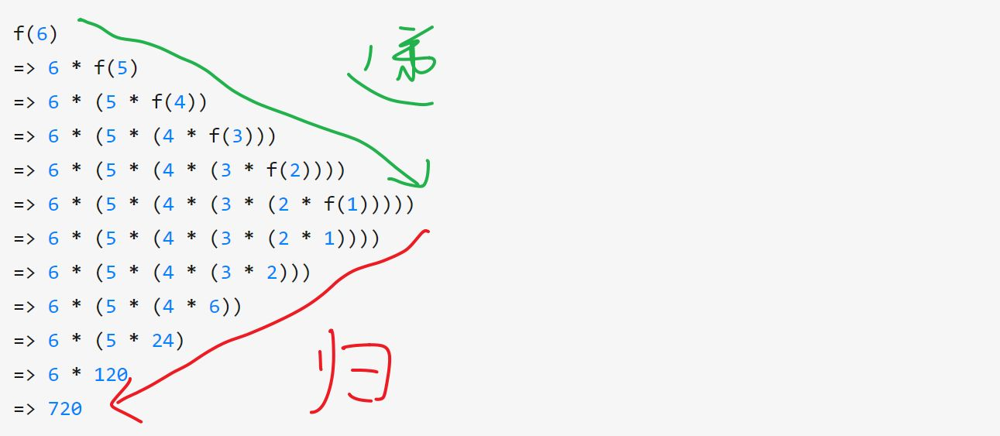

## Algorithm

题目：[N-th Tribonacci Number](https://leetcode.com/problems/n-th-tribonacci-number/)

The Tribonacci sequence Tn is defined as follows: 

T0 = 0, T1 = 1, T2 = 1, and Tn+3 = Tn + Tn+1 + Tn+2 for n >= 0.

Given `n`, return the value of Tn.

Example:

```
Input: n = 4
Output: 4
Explanation:
T_3 = 0 + 1 + 1 = 2
T_4 = 1 + 1 + 2 = 4
```

### Solution

题目是 easy 级别，只是解出来的话其实也很简单，但是涉及到的知识点其实非常多。

我第一想法是用递归：

```java
class Solution {
    public int tribonacci(int n) {
        if (n == 0) return 0;
        if (n == 1) return 1;
        if (n == 2) return 1;
        return tribonacci(n - 1) + tribonacci(n - 2) + tribonacci(n - 3);
    }
}
```

结果，一点都不意外的 Time Limit Exceeded.

于是改成了用循环来实现：

```java
class Solution {
    public int tribonacci(int n) {
        if (n < 2) return n;
        int first = 0, second = 1, third = 1, fourth;
        while (n-- > 2) {
            fourth = third + second + first;
            first = second;
            second = third;
            third = fourth;
        }
        
        return third;
    }
}
```

效率很高，战胜了 100% 的 Java 提交。

这时想起[尾递归](https://en.wikipedia.org/wiki/Tail_call)效率比普通的递归会更高一些，正好这两天正在学习 kotlin，于是写了个 kotlin 的尾递归版本：

``` kotlin
class Solution {
    tailrec fun tribonacci(n: Int, first: Int = 0, second: Int = 1, third: Int = 1): Int {
       return when(n) {
            0 -> first
            1 -> second
            2 -> third
            else -> tribonacci(n - 1, second, third, first + second + third)
        }
    }
}
```

kotlin 语言有一些函数式的思想，所以又用 kotlin 的 sequence 实现了一个版本：

```kotlin
class Solution {
    fun tribonacci(n: Int): Int {
        val trib = sequence {
            var terms = Triple(0, 1, 1)

            while (true) {
                yield(terms.first)
                terms = Triple(terms.second, terms.third, terms.first + terms.second + terms.third)
            }
        }
        return trib.take(n + 1).last();
    }
}
```

这道题还有更多解法，感兴趣的话可以看下这篇文章[「面试官问你斐波那契数列的时候不要高兴得太早」](https://zhuanlan.zhihu.com/p/54378423)。

这时候突然冒出来一个想法，到底什么是递归？于是开始搜索，看到下图后有种茅塞顿开的感觉：



出自[「对于递归有没有什么好的理解方法？」](https://www.zhihu.com/question/31412436/answer/738989709)

递归和循环有着怎样的关系？可以看下这个问答[「所有递归都可以改写成循环吗？」](https://www.zhihu.com/question/20418254/answer/112090154)

另外，什么是尾递归呢？可以看下这个问答[「什么是尾递归？」](https://www.zhihu.com/question/20761771/answer/19996299)

我自认为暂时还没办法比这几篇文章讲的更好，所以就直接放链接了（这样做并不是一个好的学习习惯）。

## Review
[Coordinators Redux](http://khanlou.com/2015/10/coordinators-redux/)
前几天[稀饭同学](https://www.codingtour.com)在工作规划里面提到了 iOS 端流程管理的问题，并附带了几个链接，顺藤摸瓜最终找到了 Coordinators Redux 这篇文章。

什么是流程管理呢？在客户端应用中，都会有各种各样的界面跳转逻辑，处理这些跳转逻辑的方式就是流程管理。iOS 和 Android 的开发框架其实都有提供相应的处理方式，但是都是非常基本的逻辑，作为系统提供的这么基础的框架，也不太可能会提供抽象层次更高的设计了，因为要综合考量各种业务复杂度的开发需求。那么当然也就有其不适用的场景，比如在界面跳转逻辑比较复杂、界面复用比较多的时候，Coordinator 这个设计思想，在这种复杂场景下就会更合适一些。

主要存在的问题：
1. 冗长的 app delegates. App delegate 的设计的目的本来是为了用来 app 和系统层进行通信的，但是由于其在 app 中的中心位置，导致大家在开发时会把各种东西都给塞进去；
2. View Controller 承载了过多的职责。 也不知道哪些该做哪些不该做：
    1. Model-View Binding
    2. Subview Allocation
    3. Data Fetching
    4. Layout
    5. Data Transformation
    6. Navigation Flow
    7. User Input
    8. Model Mutation
    9. and many more besides
3. 「顺滑的 flow」

```objective-c
- (void)tableView:(UITableView *)tableView didSelectRowAtIndexPath:(NSIndexPath *)indexPath {  
	id object = [self.dataSource objectAtIndexPath:indexPath];  
	SKDetailViewController *detailViewController = [[SKDetailViewController alloc] initWithDetailObject:object];  
	[self.navigationController pushViewController:detailViewController animated:YES];  
} 
```
这是一个常见的使用方式，可以看到，对于当前的 view controller 来说，需要去初始化 SKDetailViewController，还要用自己的父 controller 将初始化的 controller push 上去。这样相互之间有了过多的耦合，各自关注到了不该知道的事情，用作者的原话是: 
> It’s bossing its parent around. In real life, children should never boss their parents around. In programming, I would argue children shouldn’t even know who their parents are!

作者提出来的解决方案是用一个 coordinator 来承载这些流程工作，这样带来了非常多的好处，view controller 之间解耦了，也可以更好的复用了，所有的跳转逻辑都在 coordinator 中进行。而且，实现起来非常简单，不需要用什么框架或者库，只是一种思想而已。不过，我搜了下，找到了一个叫 [RxFlow](https://github.com/RxSwiftCommunity/RxFlow) 的 swift 库，简单看了下，除了实现了 coordinator 模式外，还融入了一些响应式编程的思想。因为我没用 swift 做过实际的开发，所以暂时没办法客观的评价。

## Tips
kotlin 的 inline扩展函数 + 后置 lambda 让代码更加的优雅，比如：
```kotlin
// Paint
mPaint = Paint().apply {
    color = PAINT_COLOR
    textSize = textSize
    textAlign = Paint.Align.CENTER
    strokeWidth = STROKE_WIDTH
    strokeCap = Paint.Cap.ROUND
}
```

## Share

周末在家练习 kotlin，写了个简单的自动机，代码放在 [github](https://github.com/blankyao/computation) 上了。如果你像我一样不是计算机专业出身，写了多年代码后想了解一些计算机原理相关的知识，推荐看下[《计算的本质》](https://book.douban.com/subject/26148763/) 这本书，不像其他经典巨著那样「晦涩」，对程序员特别友好，比较不容易放弃。

但是，为什么要学习这些这么难懂的东西呢？这里引用 [Introduction to the Theory of Compution](https://book.douban.com/subject/12986396/) 前言的一段话，建议你耐心读完：

> Theory is relevant to practice. It provides conceptual tools that practitioners use in computer engineering. Designing a new programming language for a specialized application? What you learned about grammars in this course comes in handy. Dealing with string searching and pattern matching? Remember finite automata and regular expressions. Confronted with a problem that seems to require more computer time than you can afford? Think back to what you learned about NP-completeness. Various application areas, such as modern cryptographic protocols, rely on theoretical principles that you will learn here.
>
> Theory also is relevant to you because it shows you a new, simpler, and more elegant side of computers, which we normally consider to be complicated machines. The best computer designs and applications are conceived with elegance in mind. A theoretical course can heighten your aesthetic sense and help you build more beautiful systems.
>
> Finally, theory is good for you because studying it expands your mind. Computer technology changes quickly. Specific technical knowledge, though useful today, becomes outdated in just a few years. Consider instead the abilities to think, to express yourself clearly and precisely, to solve problems, and to know when you haven’t solved a problem. These abilities have lasting value. Studying theory trains you in these areas.
>
> Practical considerations aside, nearly everyone working with computers is curious about these amazing creations, their capabilities, and their limitations. A whole new branch of mathematics has grown up in the past 30 years to answer certain basic questions. Here’s a big one that remains unsolved: If I give you a large number—say, with 500 digits—can you find its factors (the numbers that divide it evenly) in a reasonable amount of time? Even using a supercomputer, no one presently knows how to do that in all cases within the lifetime of the universe! The factoring problem is connected to certain secret codes in modern cryptosystems. Find a fast way to factor, and fame is yours!

这些理论不是你想象的没用，反而是用来解决非常实际的问题的，而且不仅能解决实际的问题，还能提升我们的审美，有没有想过计算机是一个多么优雅的系统？同时，在学习的过程中还能锻炼我们的思维。