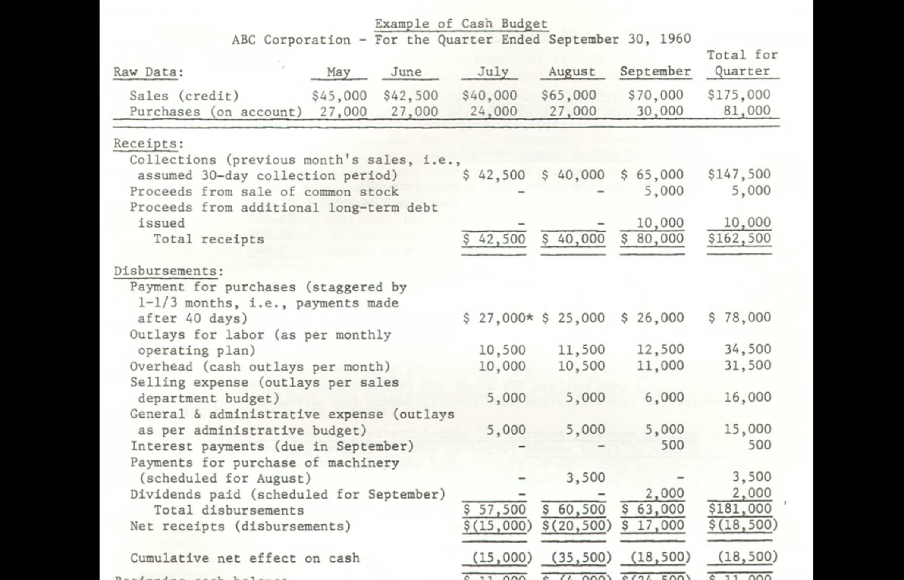
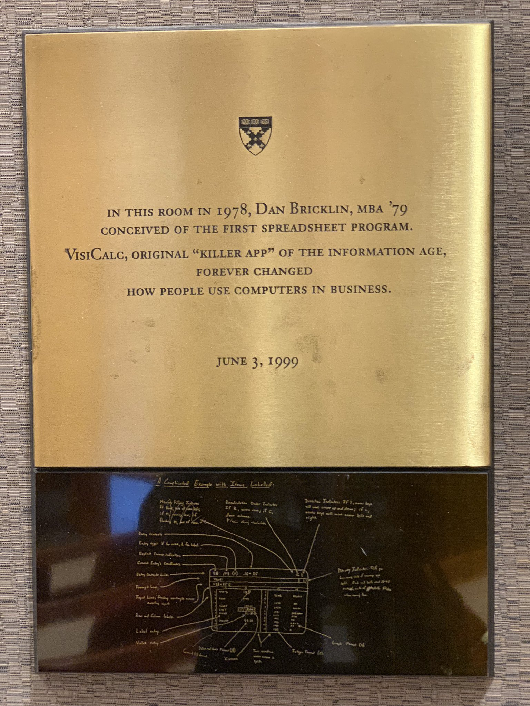

## Algorithm
题目：[Generate Parentheses](https://leetcode.com/problems/generate-parentheses/)
Given n pairs of parentheses, write a function to generate all combinations of well-formed parentheses.

### Solution
```kotlin
class Solution {
    fun generateParenthesis(n: Int): List<String> {
        val result = mutableListOf<String>()
        val curParenthesis = mutableListOf<Char>()
        backtrack( n,  n, curParenthesis, result)
        return result
    }

    fun backtrack(left: Int, right: Int, curParenthesis: MutableList<Char>, result: MutableList<String>) {
        if (right < left) return
        if (left < 0 || right < 0) return

        if (left == 0 && right == 0) {
            result.add(curParenthesis.joinToString(""))
            return
        }

        curParenthesis.add('(')
        backtrack(left - 1, right, curParenthesis, result)
        curParenthesis.removeAt(curParenthesis.size - 1)

        curParenthesis.add(')')
        backtrack(left, right - 1, curParenthesis, result)
        curParenthesis.removeAt(curParenthesis.size - 1)
    }
}
```

## Review
[A Spreadsheet Way of Knowledge](https://www.wired.com/2014/10/a-spreadsheet-way-of-knowledge/)

类似 Excel 的电子表格软件在现在看来已经是再普通不过的软件了，但是在计算机的发展史中，电子表格有着里程碑式的意义。

第一款电子表格软件软件叫 VisiCalc，运行在 Apple II 上，乔布斯对 VisiCalc 也有非常高的评价：
> VisiCalc...propelled...the success [of Apple]...more than any other single event.

在电子表格出现之前，对不会写代码的普通人来说计算机只是一个玩具，跟「计算」是一点都不沾边的，而有了电子表格后，普通人才真正的拿计算机去做「计算」这件事情，不管是商人还是学生，都可以用电子表格来做那些在这之前只有写代码才能完成的事情，同时这些对编程完全不了解的普通人还没有意识到自己其实是在编程（现在有一个非常有意思的事情，借助于 web 技术的发展，电子表格又焕发出了新的生机，比如有一些比较创新的产品可以让用户通过在线电子表格以一种低门槛的方式来开发软件或者以电子表格为载体来自定义出解决不同场景效率问题的工具，就像当年 VisiCalc 出来后大家第一次以这种方式来做计算一样，比如 [Airtable](https://airtable.com), [glide](https://www.glideapps.com)）。

1978 年，VisiCalc 的作者 Dan Bricklin 在哈佛读 MBA 时，感觉那些财务计算非常麻烦，而且如果其中某个数字有错误，后面的所有数字都要重新计算，有多年开发经验的 Dan 就开始想能否用计算机来解决这个问题呢，于是便有了后来的 VisiCalc.


后来哈佛还在 Dan 上课的那件教室里挂了一个纪念牌。


Dan 在 TEDx 的演讲 [https://www.youtube.com/watch?v=YDvbDiJZpy0](https://www.youtube.com/watch?v=YDvbDiJZpy0) 里面提到这个纪念牌时说了一句话，值得我们学习：
> But it also serves as a reminder that you, too, should take your unique backgrounds, skills and needs and build prototypes to discover and work out the key problems, and through that, change the world.

## Tips
None

## Share
None