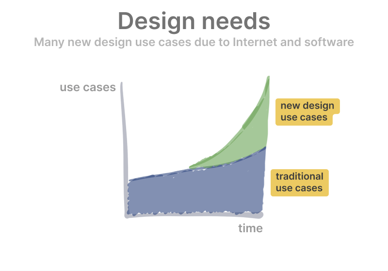
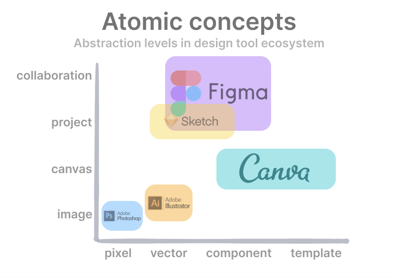
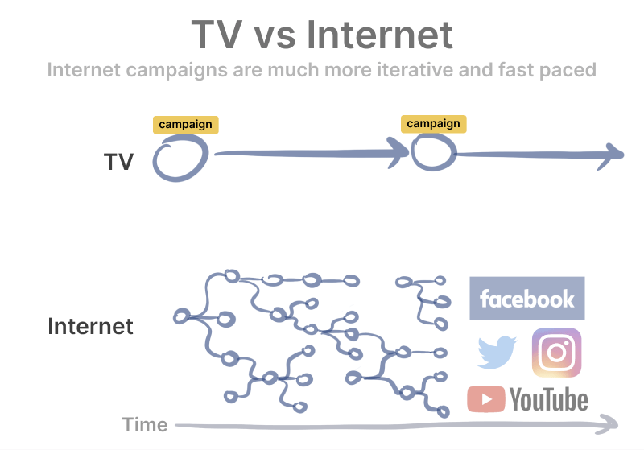

Figma 和 Canva 以及稿定是近几年在设计领域出现的颠覆性的创作工具，逐渐被越来越多的用户所接受，而在此之前基本上只有 Photoshop 一家独大。众所周知，研发 Photoshop 的 Adobe 是一家市值两千多亿美金的科技公司，其核心产品就是设计领域的各种工具，一直以来都在市场占据主导地位，而现在这个领域却在悄悄的发生着变化，在了解背后逻辑的过程中找到了 Greylock Partners 的分析师 [Kevin Kwok](https://twitter.com/kevinakwok) 所写的[这篇文章](https://kwokchain.com/2021/02/05/atomic-concepts/)，非常认同文章中的观点，所以在这里对文中的观点做下总结。

---

## Figma 和 Canva 是如何挑战 Adobe 并获取胜利的
在 2010 年，Photoshop 是无处不在的，不管你是要处理图片、制作海报或者设计网站，都会用 Photoshop, 现在的发展也很迅速，完成了向 SaaS 的无缝升级，其产品线也证明了收购新产品并集成到多产品生态的能力，就像微软，从一家按年发布产品的传统公司变成了一家按周迭代的云计算公司。

尽管如此，还是有像 Figma, Sketch 以及 Canva 在某些设计领域成为首选的工具，Figma 也在 2019 年和 2020 年都出现在了 Adobe 的年度财报里。而这些公司都有一个共同点：他们和 Adobe 相比有不同的「原子概念」，他们在构建产品时和 Adobe 在根本上是不一样的。正是这些在原子概念方面的差异让 Adobe 在已有产品和用户群方面的优势变成了阻击这些正在崛起的新秀的阻碍。这些原子概念的机会是由市场变迁过程中对新的用户场景和用户类型的发掘所驱动的。

## 新的用户场景：为数字内容而设计
互联网彻底的驱动了新的设计场景的出现，Photoshop 是用来做图片和照片编辑的，是处理「像素」层面非常好的工具，但是现在很多新的场景并不是图像处理，图像只是一个组成部分，而不是全部。

对于设计网站或者 App 的设计师来说，他们所做的 UI 和 UX 的工作更重要的是矢量，而不是图像处理。而且整个过程也更复杂，设计师要和其他设计师以及非设计师一块协作，设计工作只是一个大的产品开发过程中的一部分，更关键的是如何更高效的协作、更好的交付。

对于另一部分用户来说，他们做设计是为了发布到社交平台、数字广告平台，甚至是婚礼邀请函。对于这种场景，「像素」并不是一个好的抽象层级，图像只是包括了图形、文字等组件的设计作品中的一部分而已，而且对很多用户来说，并不会把自己当做设计师，他们只是要做一个特定的东西而已。

## 进入正确的抽象层级
Photoshop 聚焦在像素和图像，所有的操作都是在像素层级来完成，Illustrator 有点类似，只不过是在矢量层级进行操作。Sketch 也是基于矢量的，但是 Sketch 是为了那种需要在项目级别进行操作的用来打造数字产品的需求而设计的，这种需求不是单个的设计，而是完整的产品 UI, 对重复性以及一致性有一定的要求。Figma 就更近了一步，不只是聚焦在项目，而是聚焦在完整的协作。Canva 类似 Photoshop 和 Illustrator, 但是 Canva 的用户群体不是那些需要在比较底层层级进行创作的设计师，Canva 的核心原子概念是通过模板和组件帮助用户更高效的完成工作。

### Figma 押注在协同产品设计
Sketch 是最早发现数字产品设计市场的公司，它的原子概念最适合数字产品：像素和项目。但是 Sketch 只走到了一半，Sketch 没有意识到协作的重要性，设计师是在团队里面工作的，不只是和其他设计师，更重要的是和非设计师，设计工作不是独立的，而是更大的流程中的一部分。Sketch 的技术架构、价格模型以及平台结构都不适合协作类产品，所以在这个过程中也出现了像 Zeplin, Sympli 以及 Invision 这种专门解决协作问题的产品。而 Figma 在最开始就面向协作来打造，创造了新的价格模型、分发模型以及共享形式。

### Canva 押注在非设计师的营销设计
随着 Facebook, Instagram 以及 Youtube 等平台的崛起，营销和广告逐渐都变成了线上的。线上广告和传统广告有很大的差别，最重要的是线上营销节奏更快，也更有针对性。在一个营销活动中经常针对营销物料做很多小的变种，比如测试哪个版本最好、为不同的用户做个性化版本。另外，营销人员需要工具对营销物料进行一些小的调整，比如希望用同一个物料生成用于 Instagram 和 Youtube 的不同格式。虽然用 Photoshop 可以完成营销人员的需求，但是他们并不需要进行图像和像素层面的操作，在这个场景 Photoshop 的抽象层级是错误的。而 Canva 通过适用于各种目的的模板、布局以及小组件来满足了营销人员的需求。

