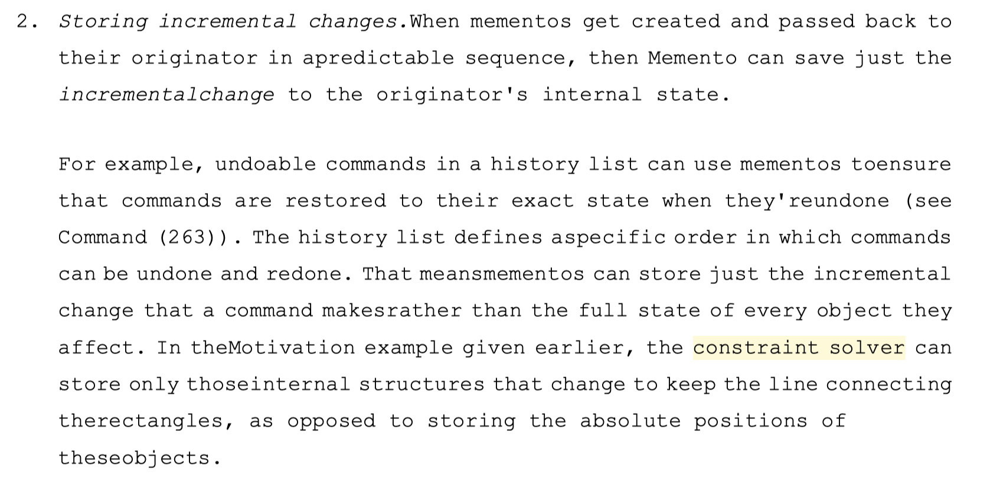

前几天在[《设计模式》](https://book.douban.com/subject/1052241/) 中 Memento 相关的介绍时看到了 Constraint Solver 这个概念，虽然从书中的案例来看是个挺简单的方法解决了一个挺简单的问题，但是感觉应该是某个领域的专业术语，勾起了我的好奇心，非常想了解是个什么东西，于是就找了各种资料了解了一下。这一周的业余时间基本上都花在这上面了，找到了很多之前不了解的东西。
。

从 [Wikipedia 的介绍](https://en.wikipedia.org/wiki/Constraint_programming)来看，Constraint Programming 是人工智能、计算机以及运筹管理学领域用的比较多的一种解决问题的范式，指的是在一系列条件约束下求出问题的解或者最优解。这里有一点要注意，Constraint Programming 中的 programming 不是我们通常所理解的 programming ，也就是说，在这里不是编程的意思，而是规划的意思，就像 Dynamic Programming 中的 Programming，所以如果要翻译成中文的话，应该是「约束规划」，而不是「约束编程」。

## 应用场景
### Constraint Satisfaction Problem
Constraint Satisfaction Problem 是 Constraint Programming 的一大应用场景，在 [Artificial Intelligence: A Modern Approach](http://aima.cs.berkeley.edu) 一书中有[专门一章](http://aima.cs.berkeley.edu/newchap05.pdf)介绍这个问题，正好官网有提供这一章的在线阅读，如果对这个领域感兴趣的话强烈推荐读一下。

书中对 Constraint Satisfaction Problem 的介绍如下（没必要翻译了）
> Formally speaking, a constraint satisfaction problem (or CSP) is defined by a set of variables, X1 , X2 , . . . , Xn , and a set of constraints, C1 , C2 , . . . , Cm . Each variable Xi has a nonempty domain Di of possible values. Each constraint Ci involves some subset of the variables and specifies the allowable combinations of values for that subset.

我们所熟知的 [N 皇后](https://leetcode.com/problems/n-queens/) 问题便是一个典型的 Constraint Satisfaction Problem。

### Constraint Optimization Problem
Constraint Satisfaction Problem 是在一系列约束下求得所有的解，而 Constraint Optimization Problems 是求得这些解在目标函数 f(x) 下的最优解。

举一个最简单的例子：用一个 20 米长的篱笆材料做成一个方形的篱笆，怎样做才能面积最大？

当然，这只是一个非常简单的例子，还有其他数学以及物理领域用的比较多的案例，已经大大超出了我的知识范围，就不班门弄斧了。

## Constraint solving
解决约束问题有三种方法，分别是 Backtracking search, Local Search 以及 Dynamic programming. 这里以 N 皇后问题为例看一下 Backtracking search 的方法：
``` java
public class NQueens {
    public List<List<String>> solveNQueens(int n) {
        char[][] puzzle = new char[n][n];
        for (int i = 0; i < n; i++) {
            for (int j = 0; j < n; j++) {
                puzzle[i][j] = '.';
            }
        }

        List<List<String>> result = new ArrayList<>();
        dfs(puzzle, 0, result);
        return result;
    }

    public void dfs(char[][] puzzle, int row, List<List<String>> result) {
        if (row == puzzle.length) {
            ArrayList<String> lineSolution = new ArrayList<>();
            for (int i = 0; i < puzzle.length; i++) {
                lineSolution.add(new String(puzzle[i]));
            }
            result.add(lineSolution);
        }

        for (int i = 0; i < puzzle.length; i++) {
            boolean legal = true;
            for (int j = 0; j < row; j++) {
                if (puzzle[j][i] == 'Q'
                        || (i + row - j < puzzle.length && puzzle[j][i + row - j] == 'Q')
                        || (i - (row - j) >= 0 && puzzle[j][i - (row - j)] == 'Q')
                ) {
                    legal = false;
                }
            }
            if (legal) {
                puzzle[row][i] = 'Q';
                dfs(puzzle, row + 1, result);
                puzzle[row][i] = '.';
            }
        }
    }
}
```
这种粗暴的方法效率并不高，特别是当问题规模（也就是 n）比较大时会非常的慢，在前面提到的 Artificial Intelligence: A Modern Approach 书中有介绍 MRV,Forward Checking 以及 Min-Conflicts 方法来进行优化。

除此之外，还有一种不那么常见，但是却是这个领域里面非常重要的解决方法 —— Constraint logic programming, 用逻辑编程的方式来解决约束问题。逻辑编程是一种编程范式，我们平时工作中大部分用的都是命令范式，程序是由若干个指令组成的，计算机运行这些指令来完成要做的事情，而逻辑范式则完全不一样，逻辑范式只需要声明目标，其他的不用管，不需要关注具体的算法，只要能分析清楚问题并把问题表达出来就可以了。我们来看一个非常简单的例子：
```prolog
programmer(blankyao).
human(X) :- programmer(X).
```
第一行定义 blankyao 是 programmer 这个事实，第二行是定义「是 programmer 的都是 human」。有了这些后，在用 human(blankyao) 进行查询时则会返回 true. 这个简单的例子或许还看不出来逻辑范式的威力，我们来看下用逻辑范式来解 N 皇后问题：
```prolog
n_queens(N, Qs) :-
        length(Qs, N),
        Qs ins 1..N,
        safe_queens(Qs).

safe_queens([]).
safe_queens([Q|Qs]) :-
        safe_queens(Qs, Q, 1),
        safe_queens(Qs).

safe_queens([], _, _).
safe_queens([Q|Qs], Q0, D0) :-
        Q0 #\= Q,
        abs(Q0 - Q) #\= D0,
        D1 #= D0 + 1,
        safe_queens(Qs, Q0, D1).
```
乍一看是挺难理解的，因为我们早就习惯了命令式编程的思维方式，用另外一种思维方式解决问题会很难理解，不过，相信我，其实不难，我也就花了不到一天的时间就入门（能看懂 N 皇后的解法）了。逻辑范式的优势是不需要关注具体实现的算法，所以代码会更加简洁清晰、易于维护，看到这句话可能你会不相信，没关系，试下就知道了，（入门）真的很简单，在 Prolog 中只有三个基本的概念，分别是事实、规则和查询，这里有一个非常简单的[入门介绍](https://draveness.me/prolog-ji-chu-1/)，看完就会有基本的了解了，继续深入的话可以看下 [The Power of Prolog](https://github.com/triska/the-power-of-prolog)，另外作者也有做了一些配套视频，比如解释[用 Prolog 解决 N 皇后问题的视频](https://www.youtube.com/watch?v=l_tbL9RjFdo&feature=youtu.be)。

另外，引用关于 Prolog 的一个观点：
> In a sense, programming in Prolog is like writing a poem: You can achieve great effects by writing under stringent constraints. In Prolog, you often get the best results by restricting your work to the pure core of the language. As long as you do this, you can benefit from strong logical properties which let you reason about your programs in systematic ways that are not available in most other programming languages.

除此之外，还有一些 toolkit 用来做 constraint solving, 比如基于 [Cassowary](https://constraints.cs.washington.edu/cassowary/) 算法实现的[各种语言的库](https://overconstrained.io)，还有 [Babelsberg](http://www.vpri.org/pdf/tr2013001_babelsberg.pdf) 这种在面向对象语言中的实现方式，也有[多种语言的实现](https://github.com/babelsberg)，还有 Google 开发的 [Google OR-Tools](https://developers.google.com/optimization/cp).

## In Real Life
说了这么多，在现实应用中能做些啥呢？理论方面的东西就不多说了，介绍一个非常直接的应用 —— 排版。

做过 iOS 的应该都知道在 iOS 里面有 autolayout 这种排版方式，可以比较方便的做出来比较灵活的排版，还创造出了一种[语法](https://developer.apple.com/library/archive/documentation/UserExperience/Conceptual/AutolayoutPG/VisualFormatLanguage.html)，比如 `V:[topField]-10-[bottomField]` 这个声明表示 topField 和 bottomField 在垂直方向上的间距是 10. iOS 用的就是 Cassowary 算法来实现的。

另外，还有人将这种排版方式引入到了 CSS 领域，也就是 [GSS](http://gss.github.io)（可惜的是这个团队已经跑路了）.