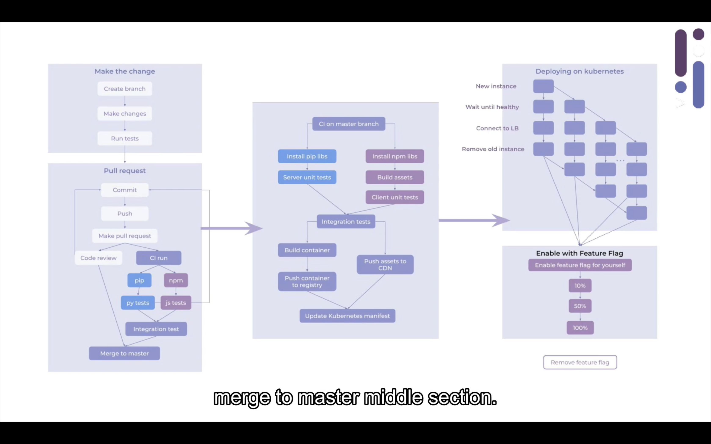
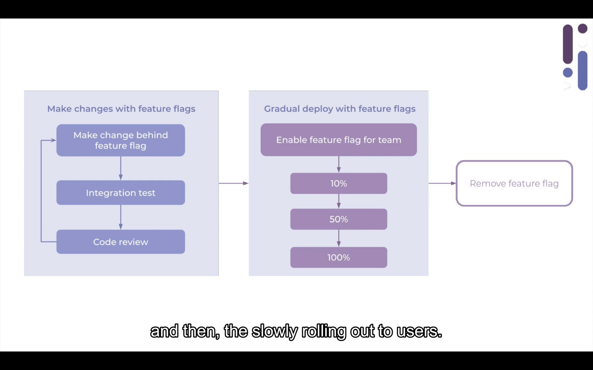

前阵子看到[一篇文章](https://macwright.org/2020/03/29/dark.html)说用一种叫 Dark 的东西以一种新的方式来构建了自己的一个 side project 的后端，周末花了点了解了一下 [Dark](https://darklang.com) 到底是个什么东西，目前 Dark 还在内测阶段，我给 Dark 的 CTO 发了个私信想要一个内测邀请，不过美国那边还在周末，还没收到回应，所以目前我还没真正的体验到，本文的内容主要来自于 Dark 的官方博客里面的 [Unveiling Dark](https://medium.com/darklang/unveiling-dark-e0be6f1e0b06) 这篇文章里面的视频。

*在继续阅读之前建议先看一下 [Building an Office Sign-In in Dark](https://medium.com/darklang/building-an-office-sign-in-in-dark-c2d980560695) 这篇文章，这篇文章通过实际案例演示了 Dark 的基本使用，可以通过阅读这篇文章先有一个直观的了解*

---
## 重新审视后端开发

即便是云服务已经发达的今天，后端开发依然是一个很难的工作，作为一个后端工程师，需要懂数据库、缓存、负载均衡、RPC、DNS、REST、CI、安全以及性能优化等等各种知识，我们也早已对这些习以为常，可是，我们为什么需要这些东西呢？或者更进一步，我们为什么需要后端工程师这个岗位呢？虽然 fullstack engineer 在某些国家已经非常普遍了，但是在中国依然很难被大家所接受，所以即使只是写一些简单的 API，也依然要有一个专门的岗位来做这样的事情，因为后端相关的工作对于前端或者客户端工程师来说是一个比较难以逾越的障碍，所以前端或者客户端工程师很难进化为「Web 应用工程师」或者「全栈工程师」。

在「远古时期」，写个 UNIX 下的软件只需要些个 makefile 就可以了，做个 Web 应用只需要通过 FTP 把 PHP 代码上传到服务器就可以了，但是随着业务复杂度的提升以及随之而来的对协作要求的提高，逐渐暴露出越来越多的问题，这些问题也一直不断的被解决，所以近些年后端领域出现了很多新的东西，比如 Docker 可以非常高效的统一后端服务运行环境，k8s 可以让一个普通的公司像 Google 那样开发并运维后端服务，还有其他的云原生应用也都极大了方便开发者，他们都非常好的解决了特定的问题，可是当所有的这些解决方案组合在一起时，就变成了一个庞然大物，带来了复杂度的提升。

在 Frederick P. Brooks 1987 年发表的论文 [No Silver Bullet](https://dl.acm.org/doi/10.1109/MC.1987.1663532) 里面提到了两种复杂度，一种是 essential complexity，这种复杂度是必须的，因为无论用多么简单的方法，所开发的软件都要满足业务的需求，另一种是 accidential complexity，这种复杂度不是必须的，比如负载均衡、CI/CD、性能优化等，这些是跟业务功能没有直接关系的，所以开发效率的提升只能从如何降低 accidential complexity 来入手。

## Dark 的方案

虽然 Dark 的官网域名是 **darklang**.com，但是实际上 Dark 并不是一个单纯的编程语言，而是集编程语言、编辑器以及基础设施三者于一体的全面解决方案。在作者看来，在这些年的技术发展过程中出现的东西都是很小的增量式改进，而 Dark 是 big change.

说到这里，需要介绍一下 Dark 的作者了，Dark 的作者是 [Paul Biggar](https://twitter.com/paulbiggar), 在开发 Dark 之前是 Circle CI 的创始人，再之前是编译器以及静态分析领域的博士，Paul 一直都在探索如何让开发更简单、如何让开发者更加高效。

Dark 在语言方面并没有什么比较特殊的地方，比较特殊的是语言、编辑器和基础设施三者之间的关系，在 Dark 的编辑器里面是可以操控一切的，所以并不是传统意义上的编辑器。

首先，Dark 中的编辑器不是基于文本的编辑器，我们日常开发用的都是基于文本的编辑器，在编辑器里面写完文本后经过词法分析和语法分析生成 AST，而 Dark 的编辑器不是这样的，Dark 是 parser free 的，也就是说写出来的代码直接就映射为 AST，所以不存在「语法错误」这么一说。在这个领域里还有 [sketch-n-sketch](https://ravichugh.github.io/sketch-n-sketch/), [MPS](https://www.jetbrains.com/mps/), [ParEdit](https://www.emacswiki.org/emacs/ParEdit), [eve](https://www.emacswiki.org/emacs/ParEdit) 等工具。

其次，在 Dark 编辑器中写的代码在 50ms 内就可以直接部署到生产环境，就像我们当年把 PHP 代码上传到服务器就直接生效那样，但是用 Dark 可以满足我们对协作的需求。

现在的部署流程是这样的：

在 Dark 中，通过编辑器和基础设施的集成以及 feature flag，让部署流程简化为下图这样：

也就是说，在 Dark 中，中间的那些环节完全都没有了，所以我们这些年在技术领域发明的这些东西都用不上了，因为问题不存在了，解决问题的方式自然也就用不上了。作者说这是一种 Deployless 的开发方式，当然 Deployless 并不是不需要 Deploy，而是不需要关心 Depoly 的问题，就像 Serverless 的意思是不需要关心 Server.

第三，在 Dark 编辑器中有 live value 的概念，大家都知道，在开发过程中，调试占了很大的时间比例。一般调试有两种方式，一种是通过断点让程序暂停，然后一步步的执行，边执行边分析；另一种是在执行程序之前先插入大量的 print 将想要观察的变量在执行时打印出来，无论哪有方式都不简单，而 Dark 的方式时在写代码时就可以看到变量的值了，所以叫做 live value.

通过这样的解决方案，做后端开发无需关注基础设施工作，也无需关注部署相关的工作。上一次出现的这种革命性的改进是 GC，GC 的出现让开发者不需要手动管理内存，解放了生产力。

## Dark 存在的问题

虽然 Dark 是一个很革命性的东西，但是还有不少问题待解决。在我看来有两个比较大的挑战，其中一个是生态，后端技术领域已经有非常成熟的生态，不管是成熟的 Java 还是年轻的 Node，都有成熟的生态，可以非常方便的使用第三方组件，而 Dark 作为一个封闭式的商业平台，如何建立这个生态？另一个是协作模式方面，我目前的了解还只是通过一些截图和 CTO 的演讲介绍，从这些有限的信息可以看到在编辑器里面写了代码就可以直接运行，在这个过程中如何做 Code Review? 如何做测试？都是比较大的挑战。